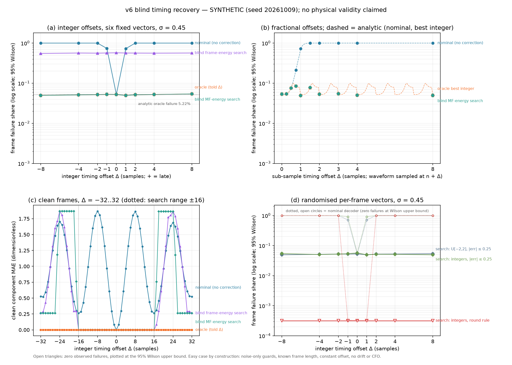
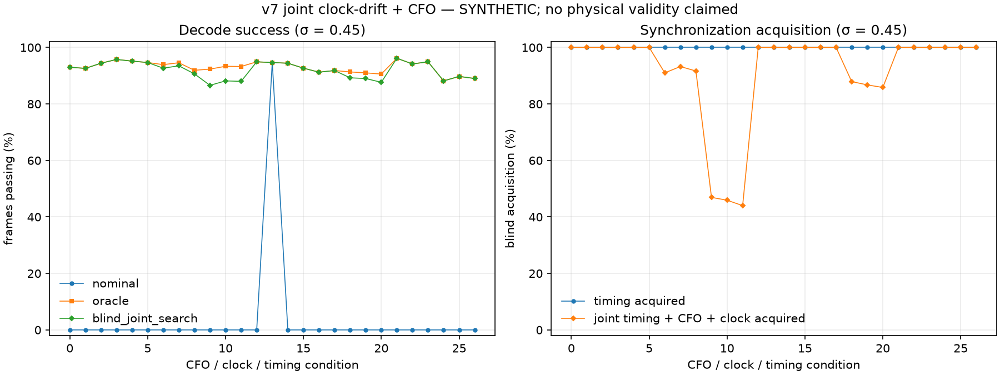

# Digital to Wave Testbench

**A synthetic, dimensionless software testbench for the signed-amplitude sine encoding printed in Mun Seok Lee's *Digital to Wave* preprint**, with seeded robustness benchmarks for sample noise, carrier-phase mismatch, carrier-frequency offset and receiver timing offset, a blind timing-recovery baseline (v6) and a joint clock-drift/CFO benchmark (v7).

[](https://github.com/sparkainlp-x/digital-to-wave-testbench/actions/workflows/tests.yml)
[](LICENSE)
[](https://doi.org/10.5281/zenodo.23122876)
[](.github/workflows/tests.yml)
[](#scope-what-it-is-not)

Evidence tags used below: **SYNTHETIC** (produced by code in this repository on generated data; rerun it yourself), **REPORTED** (stated in the author's pre-packaging reports in [`reports/`](reports/); every REPORTED number below was re-run and matched), **TARGET** (planned, not done), **UNRUN** (not executed at all).

## Scope: what it is not

**No physical validity is claimed.** This repository is a software test of one equation under arbitrary, dimensionless choices.

- **Not a model of lab-grown diamond (LGD), spin waves, phonons, NV centres, GHz hardware or any biological signal.** None of those are simulated.
- **Not a measured or realistic channel.** Noise is IID Gaussian/Laplace on samples; segments have abrupt, unfiltered boundaries; the timing grid, CFO grid and tolerances are arbitrary software stress values.
- **Not a validation of the cited preprint.** The preprint supplies the encoding equation only. The sampling, framing, matched-filter decoder, noise, scoring rule (max |error| ≤ 0.25 over 32 values) and all experiments are this project's own choices. The preprint's author has not reviewed or endorsed this software.
- **Not a preregistration.** v4, v5 and v6 conditions were fixed in a protocol lock before the full run (for v6 the lock was committed and pushed first), but these are exploratory software protocols.

## Source equation and attribution

The encoder in [`digital_to_wave.py`](digital_to_wave.py) implements the signed-amplitude sine expression printed on p. 12 of:

> Lee, Mun Seok (2026). *Digital to Wave: Paradigm Shift in Quantum Wave-Based Computing and Lab-Grown Diamond Memory.* Preprint, Zenodo. https://doi.org/10.5281/zenodo.21947036 (all versions: [10.5281/zenodo.21464222](https://doi.org/10.5281/zenodo.21464222)). CC BY 4.0.

`S(t) = (|N| · A_min) · sin(ωt + φ(N))`, with `φ = π/4` for `N > 0`, `5π/4` for `N < 0`, and zero amplitude for `N = 0`.

The module docstring calls the file `DigitaltoWave-1.pdf`; that file is byte-identical (MD5 `658ba723…`) to the `Digital to Wave-1.pdf` deposited in Zenodo record 21947036, so the page reference is to that version. No text or figures from the preprint are redistributed here.

Testbench choices: 64 samples and 4 carrier cycles per symbol (so the carrier advances **22.5° per sample**), `A_min = 1`, inputs in `[-2, 2]`, 32 values per frame, and a least-squares projection onto `sin(ωn + π/4)` as the decoder.

## Layout

| path | content |
|---|---|
| `digital_to_wave.py` | v1 codec: encoder (paper equation), noise helper, matched-filter decoder, metrics |
| `robustness_benchmark_v2.py` | v2: Gaussian/Laplace sample noise and constant per-segment carrier-phase rotation |
| `robustness_benchmark_v3.py` | v3: closed-form Gaussian calibration of the matched-filter error metrics |
| `robustness_benchmark_v4.py` | v4: continuous carrier-frequency offset (phase ramp over the frame) |
| `robustness_benchmark_v5_timing.py` | v5: constant integer-sample receiver timing offset with 64-sample zero guards |
| `robustness_benchmark_v6_timing_recovery.py` | v6 (new in 0.2.0): blind timing-recovery searches, fractional offsets, randomised vectors, clean ±32 sweep; imports v1–v5 unchanged |
| `robustness_benchmark_v7_clock_drift_cfo.py` | v7 (new in 0.3.0): joint carrier-frequency offset and sample-clock drift with nominal, informed-oracle and blind grid-search receivers; imports v1–v6 unchanged |
| `MODULES.sha256` | SHA-256 lock for v1–v7 benchmark modules; v7 is locked before its full run and checked by tests and CI |
| `artifacts/` | generated JSON/CSV/PNG for v2–v7 and the timing diagnostic, plus `SHA256SUMS` |
| `tools/` | `reproduce_all.sh`, `timing_phase_diagnostic.py` |
| `reports/` | v6 and v5 protocol locks, v4 and v5 report PDFs (REPORTED) |
| `tests/` | pytest suite |

The five original modules (and v6, which imports them) are kept as flat top-level modules with their original filenames because they import each other by those names (`from digital_to_wave import …`) and are hash-locked. Each script writes to `artifacts/` next to itself.

## Install and usage

```bash
git clone https://github.com/sparkainlp-x/digital-to-wave-testbench.git
cd digital-to-wave-testbench
python -m venv .venv && . .venv/bin/activate
python -m pip install -e ".[test]"        # Python 3.11–3.13; numpy==2.4.6, matplotlib==3.11.2 (pinned)

python robustness_benchmark_v6_timing_recovery.py  # ~65 s; prints the v6 tables and rewrites artifacts/*v6*
python robustness_benchmark_v7_clock_drift_cfo.py  # ~3 min; prints v7 summary lines and rewrites artifacts/*v7*
python robustness_benchmark_v5_timing.py   # ~7 s; prints the v5 table and rewrites artifacts/*v5*
tools/reproduce_all.sh                     # ~4.5 min; regenerates every artifact and artifacts/SHA256SUMS
python -m pytest                           # ~20 s; full v3, v4 and v5 protocols, reduced v6 and v7 runs
sha256sum -c MODULES.sha256
```

Library use:

```python
from digital_to_wave import encode_wave, decode_wave
import robustness_benchmark_v5_timing as v5

segments = encode_wave([1.0, -0.5, 0.0])          # shape (3, 64)
values = decode_wave(segments)                    # ~[1.0, -0.5, 0.0]
small = v5.run_timing_benchmark(trials_per_vector_per_condition=50)
v5.validate_timing_result(small)                  # raises ValueError on any inconsistency

import robustness_benchmark_v6_timing_recovery as v6
buf = v6.integer_offset_stream([[1.0, -0.5] + [0.0] * 30], 5)   # receiver 5 samples late
start, est = v6.matched_filter_energy_search(buf)              # blind: start == [-5], est[0][:2] ~ [1.0, -0.5]
```

## Results

All results are **SYNTHETIC**: six fixed 32-value vectors (three structured, three seeded random with seed `20261004`), pass iff max |error| ≤ 0.25, 95% Wilson intervals conditional on this fixed panel and the IID noise draws. They quantify Monte Carlo variation only, not model or physical uncertainty.

### v6 blind timing recovery (seed 20261009; σ = 0.45; new in v0.2.0)

**SYNTHETIC.** Command: `python robustness_benchmark_v6_timing_recovery.py` (~65 s). Protocol committed before the full run: [`reports/v6-timing-recovery-protocol-lock.md`](reports/v6-timing-recovery-protocol-lock.md) (lock commit [`f41da8e`](https://github.com/sparkainlp-x/digital-to-wave-testbench/commit/f41da8efc5e59ffd9b6c9311c73cc6c8ed6fbb3c); the results JSON records that commit, a clean tracked tree and the SHA-256 of all six modules). Tables: [`artifacts/robustness-benchmark-v6-timing-recovery.csv`](artifacts/robustness-benchmark-v6-timing-recovery.csv), paired comparisons [`…-paired.csv`](artifacts/robustness-benchmark-v6-timing-recovery-paired.csv), clean sweep [`…-clean-sweep.csv`](artifacts/robustness-benchmark-v6-timing-recovery-clean-sweep.csv).

v6 adds receivers that are **never told the offset**. Both search 33 candidate integer window starts (−16..+16 samples) in a 2,176-sample buffer and then hand the chosen windows to the unchanged `decode_wave`:

- **matched-filter (MF) energy search:** pick the start that maximises Σ_k (decoder output_k)² over the 32 windows;
- **raw frame-energy search:** pick the start that maximises the received energy inside the 2,048-sample frame span.

Integer offsets on the v5 grid, six fixed vectors, 12,000 noisy frames per offset (pass iff max |error| ≤ 0.25):

| offset Δ | nominal decoder (v5 receiver) | oracle told Δ | **blind MF-energy search** | MF timing acquired | blind frame-energy search (acquired) |
|---|---|---|---|---|---|
| −8 | 0 | 11,405 (95.04%) | **11,405** | 12,000/12,000 | 5,388 (5,150) |
| −4 | 0 | 11,386 (94.88%) | **11,386** | 12,000/12,000 | 5,221 (5,068) |
| −2 | 0 | 11,376 (94.80%) | **11,376** | 12,000/12,000 | 5,274 (5,097) |
| −1 | 3,167 (26.39%) | 11,367 (94.73%) | **11,367** | 12,000/12,000 | 5,209 (5,023) |
| 0 | 11,370 (94.75%) | 11,370 (94.75%) | **11,370** | 12,000/12,000 | 5,132 (4,962) |
| +1 | 3,269 (27.24%) | 11,407 (95.06%) | **11,407** | 12,000/12,000 | 5,227 (5,042) |
| +2 | 0 | 11,382 (94.85%) | **11,382** | 12,000/12,000 | 5,242 (5,070) |
| +4 | 0 | 11,373 (94.78%) | **11,373** | 12,000/12,000 | 5,278 (5,119) |
| +8 | 0 | 11,352 (94.60%) | **11,352** | 12,000/12,000 | 5,221 (5,064) |

- **The MF-energy search picked the exact start in 108,000/108,000 noisy frames** (95% Wilson lower bound 99.996% pooled; 99.968% per offset). Its pass counts equal the oracle's at every offset with **0 discordant frames** (exact McNemar p = 1). Against the nominal decoder it wins every discordant pair at |Δ| ≥ 2 (e.g. 11,405 vs 0 at −8) and 8,286 vs 86 at −1. At Δ = 0 the nominal decoder, the oracle and the search are identical (11,370), as they must be. Analytic predictions (94.78% oracle; 26.74% / 27.71% nominal at −1 / +1) lie inside every pooled Wilson interval.
- **The cruder raw frame-energy search fails:** it acquires the exact start in only 41.4–42.9% of frames and passes 42.8–44.9%, and loses to the oracle in 6,033–6,250 discordant frames per offset against 9–17 the other way (exact McNemar p below double-precision range, stored as 0.0). With σ = 0.45 a one-sample energy difference at the frame edges is buried in noise. The *metric* matters, not just the idea of searching.
- **Fractional (sub-sample) offsets** (continuous p.12 waveform sampled at n + Δ; 12,000 frames per Δ). The integer-only MF search tracks the best possible integer correction: 92.41% at Δ = 0.5, 91.52% at 0.75 and 92.22% at 1.5 versus 92.44%, 91.52% and 92.31% for an oracle told the best integer (McNemar p = 0.65, 1 and 0.11). So the integer search's loss is about 2.4–3.3 percentage points relative to on-time sampling (94.78% analytic) at the worst tested sub-sample offsets, and nothing at integer Δ. The nominal decoder falls from 94.60% (Δ = 0.25) to 78.82% (0.75), 27.74% (1.0) and 3/12,000 (1.5). The analytic nominal curve lies inside every Wilson interval. A half sample *late* costs less than a half sample early because sampling at n + 0.5 keeps all 64 samples inside their own symbol (a pure 11.25° rotation; covered by a test).
- **Randomised per-frame vectors (sensitivity):** with fresh U[−2, 2] vectors or the integer alphabet {−2..2} in every frame, the MF search again equals the oracle at every offset (0 discordant frames; 94.3–95.1% pass). The nominal decoder's ±1-sample pass share depends strongly on the vectors: 28.4–28.5% for U[−2, 2] and 9.2–9.5% for the integer alphabet, against 26.4–27.2% for the fixed panel. Under a **round-to-integer** rule (integer alphabet) the nominal decoder passes 11,996/12,000 at Δ = −1 and 12,000/12,000 at +1, but still 0 at |Δ| ≥ 2; the search and oracle pass 12,000/12,000 everywhere (closed-form oracle 99.999999%).
- **Clean sweep, Δ = −32..32:** the nominal decoder's clean MAE is periodic in the 16-sample carrier period (0 at Δ = 0, 0.97 at ±4, 1.86–1.87 at ±8 (sign inversion), 0.26 at ±16, 0.52–0.53 at ±32), so the v5 grid mostly probes carrier phase. Both searches recover exactly for |Δ| ≤ 16. Outside their ±16 range they lock onto aliases. Because the MF metric squares the outputs and so ignores the sign, at Δ = ±20 and ±24 it picks a start 8 samples off, which is a 180° sign-inverted decode (MAE 1.86–1.87).



**What this shows, and what it does not.** In this synthetic model a standard energy-based timing search (matched-filter output energy over candidate integer starts) recovers oracle-level performance at every tested integer offset, and at the best-integer level for fractional offsets. That is **easy here**: the guards contain noise only, the frame and symbol lengths are known, offsets are constant integers (or constant fractions), there is no clock drift or CFO, the carrier is locked to the sample clock, and the noise is IID Gaussian. It says nothing about real receivers, physical channels or hardware. **No physical validity is claimed.**

### v7 joint clock drift and CFO

**SYNTHETIC.** Command: `python robustness_benchmark_v7_clock_drift_cfo.py` (~3 min). Protocol: [`reports/v7-clock-drift-cfo-protocol-lock.md`](reports/v7-clock-drift-cfo-protocol-lock.md); results: [`artifacts/robustness-benchmark-v7-clock-drift-cfo.json`](artifacts/robustness-benchmark-v7-clock-drift-cfo.json), [`…csv`](artifacts/robustness-benchmark-v7-clock-drift-cfo.csv) and [`…png`](artifacts/robustness-benchmark-v7-clock-drift-cfo.png). The model combines constant timing offsets, sample-clock errors (±2500 ppm, about ±5.12 samples accumulated over 32 symbols) and CFO (±0.005 extra carrier cycles per symbol), over a full factorial grid with clean and σ = 0.25/0.45 conditions. It compares fixed-window nominal decoding, an oracle informed of all impairments, and a blind bounded joint grid search. Acquisition is reported separately from frame-decoding success, including timing-only and joint timing/clock/CFO acquisition, per-vector results and paired comparisons. These are outcomes of a stipulated synthetic model—not evidence about physical channels. The search assumes known framing, carrier family and guard size; it does not cover pulse shaping, jitter, time-varying CFO or other unmodeled impairments.

The full protocol ran from commit `1625166` with a clean tracked tree. For the no-impairment cell at σ = 0.45, all three receivers pass 1,136/1,200 frames. For CFO `+0.005`, clock error `+2500 ppm` and timing offset `+2` samples, the nominal receiver passes 0/1,200, while both the oracle and blind search pass 1,068/1,200; the blind search acquires all three parameters in 1,200/1,200 frames for that cell. Acquisition is not uniformly identifiable: at CFO 0, clock error −2500 ppm and timing +2 samples, timing acquisition is 100%, but joint parameter acquisition is 44% at σ = 0.45, and the blind pass count (1,056) is below the oracle (1,119). Results therefore distinguish accurate symbol timing from identifying the entire impairment tuple.

**Disclosure (run history).** A first full-protocol v7 run was committed in [`8da0e5e`](https://github.com/sparkainlp-x/digital-to-wave-testbench/commit/8da0e5e8c7e69d4eabc8e3bdce554e6296b2c665); it had been generated from commit `5e1d272` (an earlier locked module). The module was then changed so that the pooled (all-vector) blind-search rows also report acquisition, re-locked in [`1625166`](https://github.com/sparkainlp-x/digital-to-wave-testbench/commit/1625166418cddd39114f3ff52e49bead8571edef), and the full protocol was re-run; the committed results come from that re-run. Between the two runs all 1,701 result rows have identical pass counts and error statistics, and the paired comparisons are byte-identical; the only change is that the 81 pooled blind-search rows gained the timing and joint acquisition fields that were empty in the first run. The σ = 0.25 noise level was added after the protocol was first locked but before any results existed. Full lock history: [protocol lock](reports/v7-clock-drift-cfo-protocol-lock.md#lock-history-and-disclosure).



Paired per-vector and pooled comparisons are in [`artifacts/robustness-benchmark-v7-clock-drift-cfo-paired.csv`](artifacts/robustness-benchmark-v7-clock-drift-cfo-paired.csv). The benchmark's fixed-vector results and 95% Wilson intervals quantify Monte Carlo variation under this synthetic setup only.

### v5 integer-sample timing offset (seed 20261007; 2,000 frames per vector and offset; σ = 0.45)

Command: `python robustness_benchmark_v5_timing.py`. Full table: [`artifacts/robustness-benchmark-v5-timing.csv`](artifacts/robustness-benchmark-v5-timing.csv).

| offset (samples) | % of symbol | carrier rotation | nominal decoder pass (of 12,000) | 95% Wilson | clean nominal MAE | clean pass (of 6) | timing-aware oracle pass |
|---|---|---|---|---|---|---|---|
| −8 | −12.5% | −180° | 0 | 0–0.032% | 1.868 | 0 | 11,406 (95.05%) |
| −4 | −6.25% | −90° | 0 | 0–0.032% | 0.966 | 0 | 11,389 (94.91%) |
| −2 | −3.125% | −45° | 0 | 0–0.032% | 0.295 | 0 | 11,389 (94.91%) |
| −1 | −1.5625% | −22.5° | 3,256 (27.13%) | 26.35–27.94% | 0.081 | 6 | 11,395 (94.96%) |
| 0 | 0 | 0° | 11,382 (94.85%) | 94.44–95.23% | 0 | 6 | 11,382 (94.85%) |
| +1 | +1.5625% | +22.5° | 3,231 (26.92%) | 26.14–27.73% | 0.082 | 6 | 11,386 (94.88%) |
| +2 | +3.125% | +45° | 0 | 0–0.032% | 0.295 | 0 | 11,357 (94.64%) |
| +4 | +6.25% | +90° | 0 | 0–0.032% | 0.965 | 0 | 11,397 (94.98%) |
| +8 | +12.5% | +180° | 0 | 0–0.032% | 1.862 | 0 | 11,346 (94.55%) |

The closed-form oracle prediction is 94.78% at every offset (`erf(0.25·√32 / (0.45·√2))^32`); every prediction lies inside its pooled Wilson interval. The oracle is told the exact offset and is a diagnostic upper bound, **not** a timing-recovery algorithm (see v6 above for blind recovery). The always-zero floor passes 0/6 (clean MAE 0.977) and is a weak sanity check, not a competing decoder.


### v4 carrier-frequency offset (seed 20261006; σ = 0.45)

Nominal decoder: 11,365/12,000 (94.71%) at zero CFO; 6,380/12,000 (53.17%) at −0.0625% and 6,278/12,000 (52.32%) at +0.0625% of the carrier; 0/12,000 at ±0.125% and beyond. Known-frequency oracle 94.37–94.99% across the grid. See [`artifacts/robustness-benchmark-v4-cfo.csv`](artifacts/robustness-benchmark-v4-cfo.csv) and [`.png`](artifacts/robustness-benchmark-v4-cfo.png).

### v3 closed-form Gaussian calibration (seed 20261005)

Pooled pass shares follow the closed-form prediction across ten noise levels, e.g. σ = 0.40: 98.64% vs 98.71%; σ = 0.45: 94.71% vs 94.78%; σ = 0.50: 85.96% vs 86.07%; σ = 0.60: 56.04% vs 55.16%. See [`artifacts/robustness-benchmark-v3-gaussian-calibration.csv`](artifacts/robustness-benchmark-v3-gaussian-calibration.csv).

### v2 noise and phase sweep (seed 20261003)

200 trials per vector and condition over Gaussian and Laplace noise levels and constant phase rotations of 0–60°. See [`artifacts/robustness-benchmark-v2.csv`](artifacts/robustness-benchmark-v2.csv) and [`.png`](artifacts/robustness-benchmark-v2.png).

## Reproduction

- **v6 (v0.2.0).** The full v6 run was executed from the pushed lock commit `f41da8e` with a clean tracked tree; the JSON records this commit and the module hashes. Its CSV and PNG outputs were byte-identical under Python 3.11 and 3.13 in a reduced run, and CI regenerates the full v6 CSV/PNG on Python 3.11–3.13 and compares them byte for byte.
- **REPORTED → SYNTHETIC, reproduced (v0.1.0).** Every v4 and v5 number quoted in the reports in [`reports/`](reports/) was re-run from the hash-locked modules and matched exactly (counts) or to the printed precision (shares, intervals, MAE). The regenerated v5 plot is byte-identical (SHA-256 `d3fd82f8…`) to the plot that accompanied the v5 report.
- **Deterministic.** Two consecutive full runs gave byte-identical JSON, CSV and PNG. With the pinned dependencies, CSV and PNG files were also byte-identical between NumPy 2.4.6 and 2.5.3; JSON files differ only in their recorded software versions. CI regenerates every CSV and PNG on Python 3.11–3.13 and compares them byte for byte.
- **The v3/v4 "tie" is a coincidence, not shared noise.** v3 at σ = 0.45 and v4 at zero CFO both passed exactly 11,365/12,000. The code uses different master seeds (`20261005` vs `20261006`, each via `SeedSequence([seed, level_or_offset_index, vector_index])`), so no noise stream is shared. Per-vector counts differ (v3: 1907, 1889, 1875, 1894, 1895, 1905; v4: 1909, 1877, 1893, 1880, 1895, 1911), and pooled MAE/RMSE differ in the fourth significant digit (0.0634480 / 0.0795406 vs 0.0633640 / 0.0794490). With both counts near 94.8% of 12,000, an exact tie has a probability of roughly 1%. `tests/test_v2_v3_v4.py` pins this.

## Limitations

- **The v5 timing effect is largely carrier-phase rotation.** With 4 cycles in 64 samples, a window that starts Δ samples early or late sees its own symbol rotated by 22.5°·Δ. The clean-frame diagnostic ([`tools/timing_phase_diagnostic.py`](tools/timing_phase_diagnostic.py), [`artifacts/timing-phase-diagnostic.csv`](artifacts/timing-phase-diagnostic.csv)) shows that the decoder's own-symbol gain follows `(64−|Δ|)/64 · cos(22.5°·Δ)` within 0.03 for |Δ| ≤ 8: about 0.92 at ±1, close to 0 at ±4 (90°: clean MAE 0.966, about the always-zero floor's 0.977), and about −0.90 at ±8 (180°: sign inversion, clean MAE ≈ 1.87). At ±16 samples (one full carrier cycle) the gain recovers to 0.79 despite a larger window error. So the v5 grid mostly measures phase sensitivity of a fixed-phase in-phase projector, and only secondarily symbol-boundary (inter-symbol) leakage. Reviewer finding (SYNTHETIC diagnostic added at packaging time; the hash-locked v5 protocol is unchanged).
- **Timing recovery: done in v6 (SYNTHETIC), in an easy setting.** A blind matched-filter-energy window search recovers oracle-level performance at every tested integer offset and best-integer performance at fractional offsets (see v6). It relies on noise-only guards, a known frame length, a constant offset, a ±16-sample search range, no drift and no CFO; outside its range it can lock onto a sign-inverted alias. The nominal decoder's collapse at ±2 samples is therefore a property of a receiver *without* synchronisation. v7 adds a bounded blind grid search over static timing, clock-error and CFO candidates (see v7). **Still TARGET / UNRUN:** carrier recovery or an I/Q (quadrature) phase-tracking receiver, tracking of time-varying drift or CFO, and interpolating (sub-sample) timing recovery.
- **Fixed six-vector panel.** At ±1 sample the per-vector pass shares range from 10.7% to 62.75%, so pooled shares depend strongly on which vectors were chosen. The v6 randomised-vector panel confirms this: at ±1 the nominal decoder passes 28.4–28.5% with U[−2, 2] vectors but only 9.2–9.5% with the integer alphabet {−2..2}.
- **Arbitrary software choices.** Constant offsets only: integer in v5, integer and constant fractional in v6, static clock error and CFO on a small grid in v7 (no jitter, time-varying impairments, interpolation or pulse shaping); abrupt segment edges and zero guards; one tolerance (0.25); IID noise; one carrier/sampling ratio. Results describe this model only.
- **Physical relevance: none claimed.** See [Scope](#scope-what-it-is-not).

## Roadmap (TARGET)

- An I/Q (quadrature) phase-tracking / carrier-recovery receiver, compared against the oracle under the v4 CFO and v5/v6 timing grids (new module; v1–v6 remain locked).
- Tracking receivers for time-varying clock drift and CFO beyond v7's static grid, and an interpolating sub-sample timing estimator.
- Done in v0.3.0 (v7, SYNTHETIC): joint static clock-drift/CFO sweep with nominal, informed-oracle and blind bounded grid-search receivers.
- Done in v0.2.0 (v6, SYNTHETIC): blind integer timing-recovery baseline, fractional offsets and randomised per-frame vectors.

## Citation

See [CITATION.cff](CITATION.cff); GitHub shows a "Cite this repository" button. Releases are archived on Zenodo under the concept DOI [10.5281/zenodo.23122876](https://doi.org/10.5281/zenodo.23122876), which covers all versions. Each release also gets its own version DOI: v0.3.0 is [10.5281/zenodo.23127448](https://doi.org/10.5281/zenodo.23127448) and v0.2.0 is [10.5281/zenodo.23122877](https://doi.org/10.5281/zenodo.23122877). Cite a version DOI when you need to refer to exact code. (v0.1.0 was released before Zenodo archiving was enabled and has no DOI.) Please also cite the source preprint (above) when you refer to the encoding equation.

## License

This software is available under the GNU Affero General Public License v3.0 only (AGPL-3.0-only); see [LICENSE](LICENSE).

Organizations that want to use it in proprietary products or services without AGPL obligations can contact the author about a commercial license via https://sparkainlpx.xyz. See [COMMERCIAL-LICENSE.md](COMMERCIAL-LICENSE.md).
