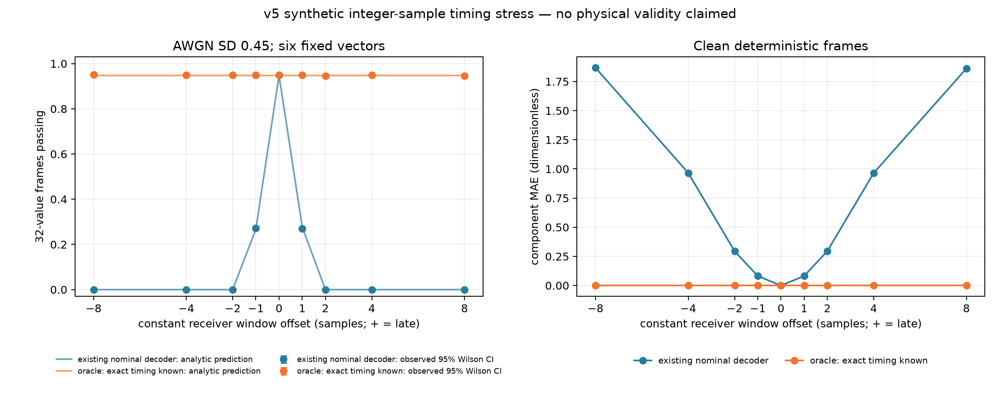

# Digital to Wave Testbench

**A synthetic, dimensionless software testbench for the signed-amplitude sine encoding printed in Mun Seok Lee's *Digital to Wave* preprint**, with seeded robustness benchmarks for sample noise, carrier-phase mismatch, carrier-frequency offset and integer-sample receiver timing offset.

[](https://github.com/sparkainlp-x/digital-to-wave-testbench/actions/workflows/tests.yml)
[](LICENSE)
[](.github/workflows/tests.yml)
[](#scope-what-it-is-not)

Evidence tags used below: **SYNTHETIC** (produced by code in this repository on generated data; rerun it yourself), **REPORTED** (stated in the author's pre-packaging reports in [`reports/`](reports/); every REPORTED number below was re-run and matched), **TARGET** (planned, not done), **UNRUN** (not executed at all).

## Scope: what it is not

**No physical validity is claimed.** This repository is a software test of one equation under arbitrary, dimensionless choices.

- **Not a model of lab-grown diamond (LGD), spin waves, phonons, NV centres, GHz hardware or any biological signal.** None of those are simulated.
- **Not a measured or realistic channel.** Noise is IID Gaussian/Laplace on samples; segments have abrupt, unfiltered boundaries; the timing grid, CFO grid and tolerances are arbitrary software stress values.
- **Not a validation of the cited preprint.** The preprint supplies the encoding equation only. The sampling, framing, matched-filter decoder, noise, scoring rule (max |error| ≤ 0.25 over 32 values) and all experiments are this project's own choices. The preprint's author has not reviewed or endorsed this software.
- **Not a preregistration.** v4 and v5 conditions were fixed in a protocol lock before the full run, but this is an exploratory software protocol.

## Source equation and attribution

The encoder in [`digital_to_wave.py`](digital_to_wave.py) implements the signed-amplitude sine expression printed on p. 12 of:

> Lee, Mun Seok (2026). *Digital to Wave: Paradigm Shift in Quantum Wave-Based Computing and Lab-Grown Diamond Memory.* Preprint, Zenodo. https://doi.org/10.5281/zenodo.21947036 (all versions: [10.5281/zenodo.21464222](https://doi.org/10.5281/zenodo.21464222)). CC BY 4.0.

`S(t) = (|N| · A_min) · sin(ωt + φ(N))`, with `φ = π/4` for `N > 0`, `5π/4` for `N < 0`, and zero amplitude for `N = 0`.

The module docstring calls the file `DigitaltoWave-1.pdf`; that file is byte-identical (MD5 `658ba723…`) to the `Digital to Wave-1.pdf` deposited in Zenodo record 21947036, so the page reference is to that version. No text or figures from the preprint are redistributed here.

Testbench choices: 64 samples and 4 carrier cycles per symbol (so the carrier advances **22.5° per sample**), `A_min = 1`, inputs in `[-2, 2]`, 32 values per frame, and a least-squares projection onto `sin(ωn + π/4)` as the decoder.

## Layout

| path | content |
|---|---|
| `digital_to_wave.py` | v1 codec: encoder (paper equation), noise helper, matched-filter decoder, metrics |
| `robustness_benchmark_v2.py` | v2: Gaussian/Laplace sample noise and constant per-segment carrier-phase rotation |
| `robustness_benchmark_v3.py` | v3: closed-form Gaussian calibration of the matched-filter error metrics |
| `robustness_benchmark_v4.py` | v4: continuous carrier-frequency offset (phase ramp over the frame) |
| `robustness_benchmark_v5_timing.py` | v5: constant integer-sample receiver timing offset with 64-sample zero guards |
| `MODULES.sha256` | SHA-256 lock for the five original modules (unchanged; checked by tests and CI) |
| `artifacts/` | generated JSON/CSV/PNG for v2–v5 and the timing diagnostic, plus `SHA256SUMS` |
| `tools/` | `reproduce_all.sh`, `timing_phase_diagnostic.py` |
| `reports/` | v5 protocol lock, v4 and v5 report PDFs (REPORTED) |
| `tests/` | pytest suite |

The five original modules are kept as flat top-level modules with their original filenames because they import each other by those names (`from digital_to_wave import …`) and are hash-locked. Each script writes to `artifacts/` next to itself.

## Install and usage

```bash
git clone https://github.com/sparkainlp-x/digital-to-wave-testbench.git
cd digital-to-wave-testbench
python -m venv .venv && . .venv/bin/activate
python -m pip install -e ".[test]"        # Python 3.11–3.13; numpy==2.4.6, matplotlib==3.11.2 (pinned)

python robustness_benchmark_v5_timing.py   # ~7 s; prints the v5 table and rewrites artifacts/*v5*
tools/reproduce_all.sh                     # ~20 s; regenerates every artifact and artifacts/SHA256SUMS
python -m pytest                           # ~20 s; includes the full v3, v4 and v5 protocols
sha256sum -c MODULES.sha256
```

Library use:

```python
from digital_to_wave import encode_wave, decode_wave
import robustness_benchmark_v5_timing as v5

segments = encode_wave([1.0, -0.5, 0.0])          # shape (3, 64)
values = decode_wave(segments)                    # ~[1.0, -0.5, 0.0]
small = v5.run_timing_benchmark(trials_per_vector_per_condition=50)
v5.validate_timing_result(small)                  # raises ValueError on any inconsistency
```

## Results

All results are **SYNTHETIC**: six fixed 32-value vectors (three structured, three seeded random with seed `20261004`), pass iff max |error| ≤ 0.25, 95% Wilson intervals conditional on this fixed panel and the IID noise draws. They quantify Monte Carlo variation only, not model or physical uncertainty.

### v5 integer-sample timing offset (seed 20261007; 2,000 frames per vector and offset; σ = 0.45)

Command: `python robustness_benchmark_v5_timing.py`. Full table: [`artifacts/robustness-benchmark-v5-timing.csv`](artifacts/robustness-benchmark-v5-timing.csv).

| offset (samples) | % of symbol | carrier rotation | nominal decoder pass (of 12,000) | 95% Wilson | clean nominal MAE | clean pass (of 6) | timing-aware oracle pass |
|---|---|---|---|---|---|---|---|
| −8 | −12.5% | −180° | 0 | 0–0.032% | 1.868 | 0 | 11,406 (95.05%) |
| −4 | −6.25% | −90° | 0 | 0–0.032% | 0.966 | 0 | 11,389 (94.91%) |
| −2 | −3.125% | −45° | 0 | 0–0.032% | 0.295 | 0 | 11,389 (94.91%) |
| −1 | −1.5625% | −22.5° | 3,256 (27.13%) | 26.35–27.94% | 0.081 | 6 | 11,395 (94.96%) |
| 0 | 0 | 0° | 11,382 (94.85%) | 94.44–95.23% | 0 | 6 | 11,382 (94.85%) |
| +1 | +1.5625% | +22.5° | 3,231 (26.92%) | 26.14–27.73% | 0.082 | 6 | 11,386 (94.88%) |
| +2 | +3.125% | +45° | 0 | 0–0.032% | 0.295 | 0 | 11,357 (94.64%) |
| +4 | +6.25% | +90° | 0 | 0–0.032% | 0.965 | 0 | 11,397 (94.98%) |
| +8 | +12.5% | +180° | 0 | 0–0.032% | 1.862 | 0 | 11,346 (94.55%) |

The closed-form oracle prediction is 94.78% at every offset (`erf(0.25·√32 / (0.45·√2))^32`); every prediction lies inside its pooled Wilson interval. The oracle is told the exact offset and is a diagnostic upper bound, **not** a timing-recovery algorithm. The always-zero floor passes 0/6 (clean MAE 0.977) and is a weak sanity check, not a competing decoder.



### v4 carrier-frequency offset (seed 20261006; σ = 0.45)

Nominal decoder: 11,365/12,000 (94.71%) at zero CFO; 6,380/12,000 (53.17%) at −0.0625% and 6,278/12,000 (52.32%) at +0.0625% of the carrier; 0/12,000 at ±0.125% and beyond. Known-frequency oracle 94.37–94.99% across the grid. See [`artifacts/robustness-benchmark-v4-cfo.csv`](artifacts/robustness-benchmark-v4-cfo.csv) and [`.png`](artifacts/robustness-benchmark-v4-cfo.png).

### v3 closed-form Gaussian calibration (seed 20261005)

Pooled pass shares follow the closed-form prediction across ten noise levels, e.g. σ = 0.40: 98.64% vs 98.71%; σ = 0.45: 94.71% vs 94.78%; σ = 0.50: 85.96% vs 86.07%; σ = 0.60: 56.04% vs 55.16%. See [`artifacts/robustness-benchmark-v3-gaussian-calibration.csv`](artifacts/robustness-benchmark-v3-gaussian-calibration.csv).

### v2 noise and phase sweep (seed 20261003)

200 trials per vector and condition over Gaussian and Laplace noise levels and constant phase rotations of 0–60°. See [`artifacts/robustness-benchmark-v2.csv`](artifacts/robustness-benchmark-v2.csv) and [`.png`](artifacts/robustness-benchmark-v2.png).

## Reproduction (v0.1.0)

- **REPORTED → SYNTHETIC, reproduced.** Every v4 and v5 number quoted in the reports in [`reports/`](reports/) was re-run from the hash-locked modules and matched exactly (counts) or to the printed precision (shares, intervals, MAE). The regenerated v5 plot is byte-identical (SHA-256 `d3fd82f8…`) to the plot that accompanied the v5 report.
- **Deterministic.** Two consecutive full runs gave byte-identical JSON, CSV and PNG. With the pinned dependencies, CSV and PNG files were also byte-identical between NumPy 2.4.6 and 2.5.3; JSON files differ only in their recorded software versions. CI regenerates every CSV and PNG on Python 3.11–3.13 and compares them byte for byte.
- **The v3/v4 "tie" is a coincidence, not shared noise.** v3 at σ = 0.45 and v4 at zero CFO both passed exactly 11,365/12,000. The code uses different master seeds (`20261005` vs `20261006`, each via `SeedSequence([seed, level_or_offset_index, vector_index])`), so no noise stream is shared. Per-vector counts differ (v3: 1907, 1889, 1875, 1894, 1895, 1905; v4: 1909, 1877, 1893, 1880, 1895, 1911), and pooled MAE/RMSE differ in the fourth significant digit (0.0634480 / 0.0795406 vs 0.0633640 / 0.0794490). With both counts near 94.8% of 12,000, an exact tie has a probability of roughly 1%. `tests/test_v2_v3_v4.py` pins this.

## Limitations

- **The v5 timing effect is largely carrier-phase rotation.** With 4 cycles in 64 samples, a window that starts Δ samples early or late sees its own symbol rotated by 22.5°·Δ. The clean-frame diagnostic ([`tools/timing_phase_diagnostic.py`](tools/timing_phase_diagnostic.py), [`artifacts/timing-phase-diagnostic.csv`](artifacts/timing-phase-diagnostic.csv)) shows that the decoder's own-symbol gain follows `(64−|Δ|)/64 · cos(22.5°·Δ)` within 0.03 for |Δ| ≤ 8: about 0.92 at ±1, close to 0 at ±4 (90°: clean MAE 0.966, about the always-zero floor's 0.977), and about −0.90 at ±8 (180°: sign inversion, clean MAE ≈ 1.87). At ±16 samples (one full carrier cycle) the gain recovers to 0.79 despite a larger window error. So the v5 grid mostly measures phase sensitivity of a fixed-phase in-phase projector, and only secondarily symbol-boundary (inter-symbol) leakage. Reviewer finding (SYNTHETIC diagnostic added at packaging time; the hash-locked v5 protocol is unchanged).
- **No timing-recovery or carrier-recovery baseline is included yet (TARGET).** The only comparison is an oracle that is told the true offset. A blind synchroniser (for example a timing-error detector or a joint I/Q phase estimate) has not been implemented or run (**UNRUN**). The nominal decoder's collapse at ±2 samples should not be read as the behaviour of a receiver with synchronisation.
- **Fixed six-vector panel.** At ±1 sample the per-vector pass shares range from 10.7% to 62.75%, so pooled shares depend strongly on which vectors were chosen.
- **Arbitrary software choices.** Integer offsets only (no fractional timing, clock drift, interpolation or pulse shaping); abrupt segment edges and zero guards; one tolerance (0.25); IID noise; one carrier/sampling ratio. Results describe this model only.
- **Physical relevance: none claimed.** See [Scope](#scope-what-it-is-not).

## Roadmap (TARGET)

- A blind timing-recovery baseline and an I/Q (quadrature) phase-tracking receiver, compared against the oracle under the v5 grid (new v6 module; v1–v5 remain locked).
- Fractional offsets and randomised per-frame vectors.

## Citation

See [CITATION.cff](CITATION.cff). Once the repository is archived on Zenodo, each release gets a version DOI and the project a concept DOI covering all versions; they will be added here. Please also cite the source preprint (above) when you refer to the encoding equation.

## License

This software is available under the GNU Affero General Public License v3.0 only (AGPL-3.0-only); see [LICENSE](LICENSE).

Organizations that want to use it in proprietary products or services without AGPL obligations can contact the author about a commercial license via https://sparkainlpx.xyz. See [COMMERCIAL-LICENSE.md](COMMERCIAL-LICENSE.md).
